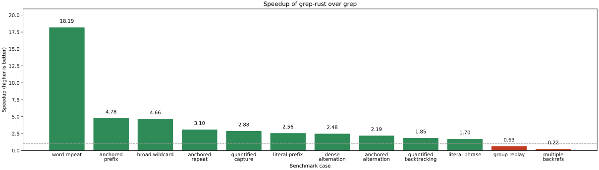

# grep-rust

A small `grep` implementation in Rust with a custom regex engine, recursive file search, only-match output, ANSI highlighting, and a benchmark workflow against system `grep`.

[](https://app.codecrafters.io/users/aaron-ang)

## Features

### CLI

- Search stdin or one or more files
- Recursive directory traversal with `-r`
- Print only matched text with `-o`
- Highlight matches with `--color=always|auto|never`
- Exit with code `0` when at least one match is found, `1` otherwise

### Regex engine

- Literal characters
- Wildcard `.`
- Character classes `\d` and `\w`
- Character groups like `[abc]` and negated groups like `[^abc]`
- Anchors `^` and `$`
- Quantifiers `?`, `+`, `*`, `{n}`, `{n,}`, `{n,m}`
- Grouping and alternation with `(...)` and `|`
- Backreferences like `\1`

## Usage

Run against stdin:

```sh
echo 'The king had 10 children' | cargo run -- -E '\d+'
```

Search files:

```sh
cargo run -- -E 'hello\d+' path/to/file.txt
```

Recursive search:

```sh
cargo run -- -r -E 'hello\d+' src
```

Only matching output:

```sh
echo 'jekyll and hyde' | cargo run -- -o -E '(jekyll|hyde)'
```

Highlighted output:

```sh
echo 'I have 3 apples' | cargo run -- --color=always -E '\d'
```

## Development

Format, lint, and test:

```sh
cargo fmt
cargo clippy --all-targets --all-features -- -D warnings
cargo test
```

## Benchmarking

Install `hyperfine` locally:

```sh
brew install hyperfine
```

Create the Python virtual environment and install plotting dependencies:

```sh
uv venv
source .venv/bin/activate
uv pip install -r requirements.txt
```

Generate all benchmark corpora:

```sh
uv run scripts/gen-bench-data.sh
```

Run the benchmark matrix and generate the SVG chart:

```sh
uv run scripts/bench.py
```

Re-render the chart from the saved benchmark JSON without rerunning `hyperfine`:

```sh
uv run scripts/plot.py
```

By default this benchmarks `grep-rust` against system `grep` across a fixed set of patterns:

- `bench/data.txt`
  - `matched_line_[0123456789]+`
  - `^log=[0123456789]+ level=INFO`
  - `message=(matched_line|ordinary_line)_[0123456789]+`
- `bench/words.txt`
  - `cat dog bird`
  - `^(cat dog bird|dog bird cat)$`
  - `^.+ .+ .+$`
- `bench/nearmiss_small.txt`
  - `a+a+a+a+b`

`scripts/gen-bench-data.sh` generates all three corpora, and `scripts/bench.py` will call it automatically if any benchmark input is missing. The benchmark data and chart are written to:

```text
bench/benchmark.json
bench/benchmark.svg
```

`scripts/bench.py` uses `hyperfine --warmup 3` and otherwise leaves hyperfine's run-count defaults in place.

The benchmark uses multiple corpora instead of a single file because each one stresses a different behavior:

- `bench/data.txt` covers literal prefixes, anchors, and alternation on structured log lines
- `bench/words.txt` covers simple literal and broad wildcard scans on short repeated phrases
- `bench/nearmiss_small.txt` stresses quantified near-miss backtracking

## Benchmark Chart



## Optimization Notes

The current implementation is competitive with system `grep` mainly because it uses a hybrid search pipeline instead of one matcher for every pattern:

- Pure literals and literal-only alternations are routed to `aho-corasick`
- Regular regexes are compiled with `regex-automata`
- Backreference patterns fall back to the custom matcher instead of slowing down the normal path
- Searches return byte spans directly, so `-o` and highlighting reuse the same match data
- Output stays buffered, which keeps printing overhead from dominating the benchmark

The exact benchmark result is still workload-dependent, so some patterns will benefit more than others.
